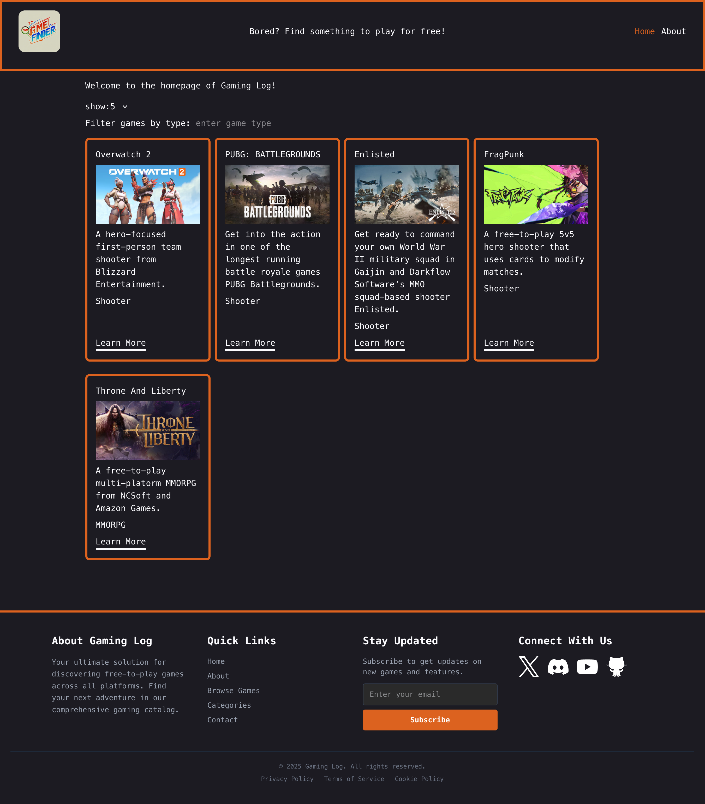
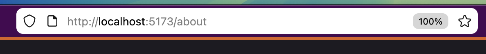
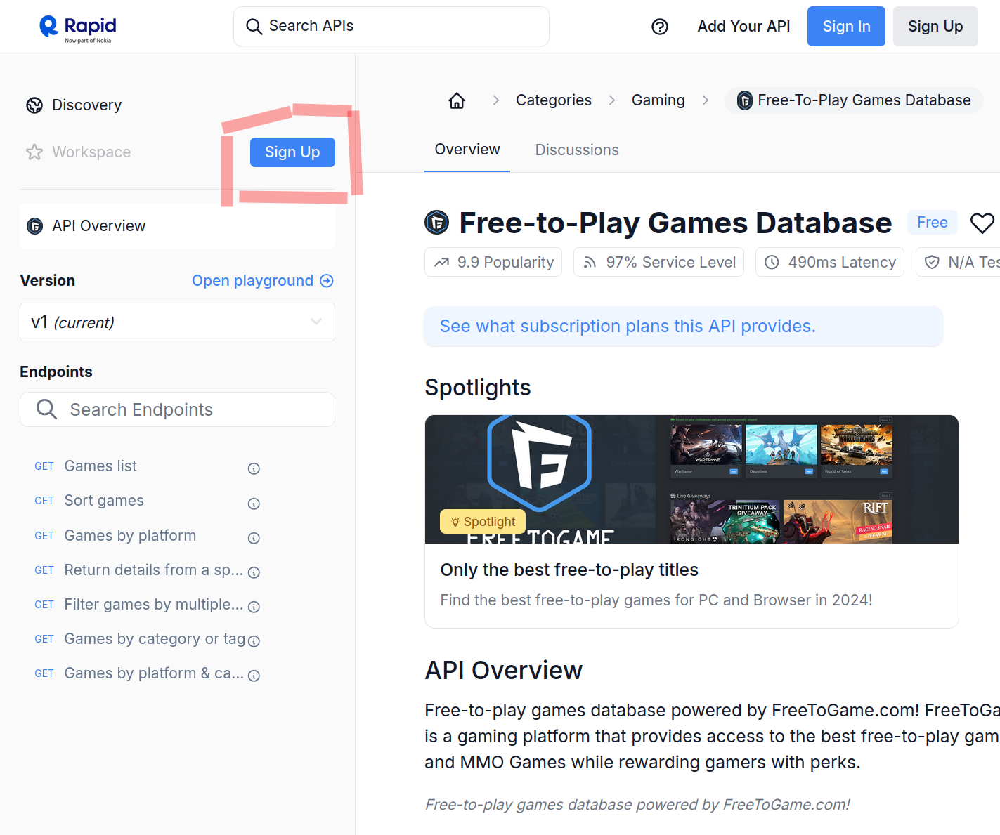
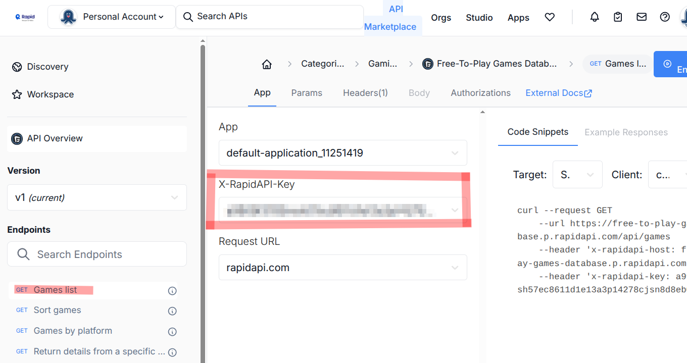
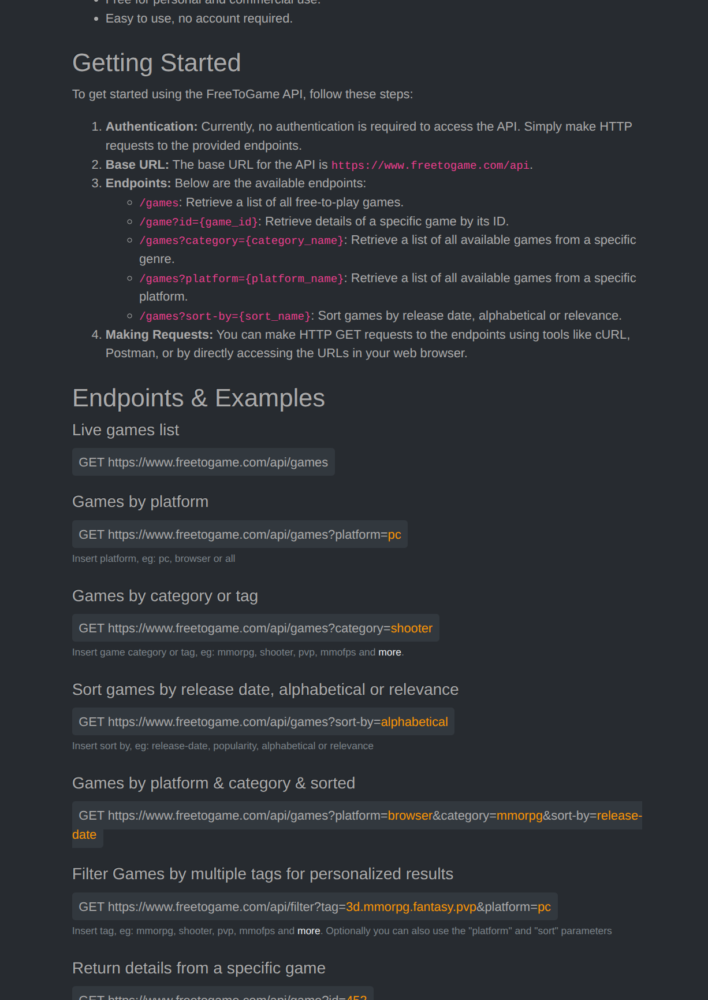

# React - APIs & Routing

## Design

Your task is to create a site that **_closely_** resembles (looks as close as possible) to the one found under `/design` folder: `design/design.png`.

> [!IMPORTANT]
> You are to use `tailwindcss` for this project. Appreciate how much work they do for you!

## Accessibility

Be mindful of authoring your `HTML`. Your site must be usable and functional with a keyboard for any expected interaction from the user. Remember the `document outline` as well.

## Routing

For a full video on what your application routes are and how they behave, see `design/videos/routes.mp4`.

- Users should be able to navigate to `/`, `/about`, `/game/:id`; any other route should show a `not found` error page `/example`, `/test`, `/foo`, etc.

- A click on the logo should take an user to `/`, or home.

> [!IMPORTANT]
> You are expected to use `react-router` in declarative mode.

## Requirements

For a full video on what your application is expected to behave, see `design/videos/core-app-functionality.mp4` and `game-id-route.mp4`.

> [!IMPORTANT]
> The state (games data) from fetching the `API` should be `persistent`: navigating between routes `MUST NOT FETCH DATA AGAIN`; it is persistent between routes. See `/design/videos/persistent-state.mp4` for expectations.

## Theming Preference

The theme (light or dark) should be set based on user browser settings. See `design/videos/theme-user-preferences.mp4` for expectations.

## Footer Behaviour

Be mindful of authoring your `HTML` footer section as there is lots of text. See `design/videos/footer-subscription-simulation.mp4` for subscription behaviour.

## Project setup

Make sure to setup `eslint` as well as common plugins for `React`. Also, make sure to setup `eslint` plugin: `eslint-plugin-better-tailwindcss`.

## Social Media Icons

You can get the `svg` code for the design social media icons at [social-media](https://simpleicons.org)

## API Documentation

> [!NOTE]
> You can use `postman` to test the `API` first. See [postman](https://www.postman.com/)

Sign up for an `API key` [here](https://rapidapi.com/digiwalls/api/free-to-play-games-database). Click on `Sign Up` and follow the process.

Once you have signed up, click on `Games List` to see your `API KEY`. This is the key that would go in the request header: `x-rapidapi-key: <YOUR_API_KEY>`.

Now that you have an `API KEY`, head over to [endpoints](https://www.freetogame.com/api-doc):

> [!IMPORTANT]
> Using the `API` from `https://www.freetogame.com/api-doc` as it is will give you `CORS` errors. Make sure to use `rapidapi` as a proxy.
